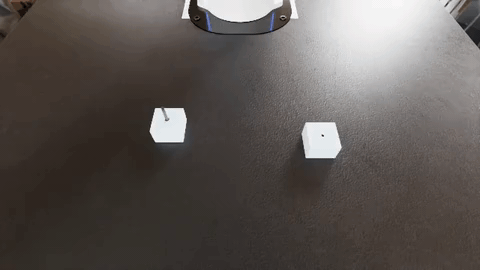
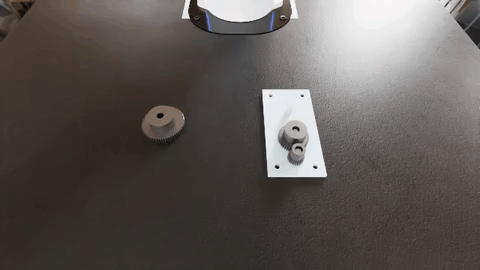

# AssembleBench

**Contact-rich robot assembly tasks for evaluating and training VLAs.**
Tested headless on L40S, RTX 6000 Ada, and RTX PRO 6000 Blackwell GPUs.

14 tabletop tasks - insert pegs, mesh gears, thread nuts - modelled on the
[NIST ATB-1 assembly taskboard](https://www.nist.gov/el/intelligent-systems-division-73500/robotic-grasping-and-manipulation-assembly/assembly).
The robot is the [DROID](https://arxiv.org/abs/2403.12945) platform (Franka Panda 7-DoF +
Robotiq 2F-85), so DROID checkpoints plug in without retargeting. Success is scored on
real assembly geometry, not a proximity heuristic: the part has to seat, and a gear that
clashes teeth or a nut that cross-threads cannot descend.

- Blog post: [Benchmarking Robot Models on Contact-Rich Assembly](https://www.hud.ai/blog/assemble-benchmark)
- Demonstration dataset (1355 episodes): [`hud-evals/AssembleBench`](https://huggingface.co/datasets/hud-evals/AssembleBench)
- Reference checkpoints: [`pi05-AssembleBench-12k`](https://huggingface.co/hud-evals/pi05-AssembleBench-12k) (BC) · [`pi05-AssembleBench-cgdagger-r3`](https://huggingface.co/hud-evals/pi05-AssembleBench-cgdagger-r3) (final)

## Tasks

| | Family | Tasks | Skills |
|---|---|---|---|
| 🟦 | Round peg insertion | `peg_round_4mm` `peg_round_8mm` `peg_round_12mm` `peg_round_16mm` | insertion |
| 🟪 | Square peg insertion | `peg_square_4mm` `peg_square_8mm` `peg_square_12mm` `peg_square_16mm` | alignment, insertion |
| 🟧 | Gear meshing | `gear_small` `gear_medium` `gear_large` | alignment, insertion, fitting |
| 🟩 | Nut threading | `nut_M8` `nut_M12` `nut_M16` | alignment, threading |

Peg names are stem diameters in mm. Pegs start upright in a presentation bore; gears and
nuts start flat on the table. Square pegs are not yaw-symmetric - the hole is re-clocked
every episode. Part poses are jittered every episode.

`debug` (apple in a bowl) is a hello-world check, not part of the benchmark.

### pi0.5 successes (one per suite)

Front-camera rollouts from [`pi05-AssembleBench-12k`](https://huggingface.co/hud-evals/pi05-AssembleBench-12k), 5×:

<p align="center">
  
  
</p>
<p align="center">
  
  
</p>

<p align="center">
  <sub>
    🟦 <code>peg_round_4mm</code> ·
    🟪 <code>peg_square_16mm</code> ·
    🟧 <code>gear_large</code> ·
    🟩 <code>nut_M16</code>
  </sub>
</p>

## Requirements

- NVIDIA GPU with RT cores - 16 GB+ for the simulator, 24 GB+ if a VLA shares the GPU
  (A100 / H100 cannot render)
- Ubuntu 22.04+ (Isaac Sim 6 needs GLIBC >= 2.35)
- **Docker (recommended):** NVIDIA container toolkit + [NGC](https://ngc.nvidia.com) login
  (`docker login nvcr.io`). No Isaac Sim on the host.
- **Host Isaac Sim:** [Isaac Sim 6.x](https://docs.isaacsim.omniverse.nvidia.com/current/installation/download.html)
  and `export OMNI_KIT_ACCEPT_EULA=YES` in every shell that launches Isaac.

Path B also needs a separate **Python 3.12+** env (`lerobot==0.6.0` will not install on
3.10) and a Hugging Face login that has accepted
[`google/paligemma-3b-pt-224`](https://huggingface.co/google/paligemma-3b-pt-224)
(the pi0.5 tokenizer is gated; checkpoints are public).

### Tested versions

| Component | Pinned at | Where the pin lives |
|---|---|---|
| Isaac Sim (Docker base) | `nvcr.io/nvidia/isaac-sim:6.0.0-dev2` | [`docker/Dockerfile`](docker/Dockerfile) |
| Isaac Sim (host install) | pip `isaacsim[all,extscache]==6.0.0.1` | – |
| Isaac Lab + Isaac Lab Arena | exact commits | git submodules |
| `hud` (env server) | git `014a43f6` (DirectControl; includes GymBridge from [#481](https://github.com/hud-evals/hud-python/pull/481)) | [`scripts/setup_sim.sh`](scripts/setup_sim.sh), [`docker/Dockerfile`](docker/Dockerfile), [`docker/modal_image.sh`](docker/modal_image.sh) |
| `hud` (VLA agent freeze) | git `a08d8d83` | [`requirements-agent.txt`](requirements-agent.txt), [`requirements-agent.lock`](requirements-agent.lock) |
| Agent env (torch `2.11.0`, lerobot `0.6.0`, …) | full freeze (Python 3.12) | [`requirements-agent.lock`](requirements-agent.lock) |

## Install

Clone, then fetch the Arena / IsaacLab submodules with the setup script (not
`git clone --recursive` - Arena pins nested `git@` remotes and docs-only LFS media;
the script rewrites remotes to HTTPS and skips the LFS):

```bash
git clone https://github.com/hud-evals/assemble-bench.git
cd assemble-bench
./scripts/setup_sim.sh --submodules-only
```

### Option 1 - Docker (recommended)

```bash
docker build -f docker/Dockerfile -t assemble-bench-env .
```

See [`docker/docker.md`](docker/docker.md) for serving Path B, running Path A inside the
container, and cache mounts that cut boots from ~15 min to ~2 min.

### Option 2 - Host Isaac Sim

Inside your Isaac Sim environment (conda, or NGC container shell - there, use
`/isaac-sim/python.sh -m pip` instead of `pip`):

```bash
export OMNI_KIT_ACCEPT_EULA=YES

# Isaac Lab at Arena's pinned commit (deps ship with Isaac Sim):
for d in submodules/IsaacLab-Arena/submodules/IsaacLab/source/isaaclab*/; do
  pip install --no-deps -e "$d"
done

# Arena + two undeclared runtime deps:
pip install -e submodules/IsaacLab-Arena "pin-pink==3.1.0" "rsl-rl-lib==5.0.1"

# This bench + HUD serving stack for Path B:
pip install -e assemble_bench
# GymBridge + DirectControl (not on PyPI 0.6.x):
pip install "hud @ git+https://github.com/hud-evals/hud-python.git@014a43f69b20b1addfc3b2647c9bd8d967be75e3" msgpack
pip install --no-deps "av>=12" "openpi-client==0.1.2"
```

`./scripts/setup_sim.sh` runs these steps (plus the submodule fetch above).

## Running the benchmark

**Path A** drives Isaac Sim directly. **Path B (HUD)** serves the sim over the network for
VLA evals, parallel envs, and optional traces.

### Path A - Isaac Sim directly

Smoke-test that the scene builds (zero actions, no weights), from the repo root with the
Isaac env active:

```bash
cd submodules/IsaacLab-Arena
OMNI_KIT_ACCEPT_EULA=YES python isaaclab_arena/evaluation/policy_runner.py \
    --policy_type zero_action --num_episodes 1 --headless \
    --external_environment_class_path \
    assemble_bench.environments.assembly.assembly:AssembleBenchEnvironment \
    assemble_bench --task peg_round_8mm
```

| Flag | Default | Notes |
|---|---|---|
| `--task` | `peg_round_8mm` | any task id above, or `debug` |
| `--embodiment` | `droid_abs_joint_pos_softmimic` | contact-tuned DROID; `droid_abs_joint_pos` is stock |
| `--reward` | `none` | `staged` / `potential` for dense RL rewards |
| `--hdr` | `asm_machine_shop` | any Arena HDR name, or `none` |
| `--num_envs` | `1` | parallel envs on one GPU |

The same Path A command also runs inside the Docker image - see
[`docker/docker.md`](docker/docker.md).

### Path B - HUD

Serve the environment once, then attach a policy over TCP.

**1. Serve the env**

Docker (details in [`docker/docker.md`](docker/docker.md)):

```bash
docker run -d --name assemble-bench --gpus all \
  -e NVIDIA_DRIVER_CAPABILITIES=all -e OMNI_KIT_ACCEPT_EULA=YES \
  -p 127.0.0.1:8765:8765 assemble-bench-env
```

Or host Isaac (Install Option 2):

```bash
OMNI_KIT_ACCEPT_EULA=YES python -m hud.environment.server env.py --port 8765
```

Wait for `HUD_SERVE_PORT=8765` in the logs (first boot can take 5-15 minutes).

**2. Run a VLA**

In the agent env (`./scripts/setup_agent.sh`, or see [`examples/README.md`](examples/README.md)).
DROID wire: front + wrist RGB at 640×360, joint positions, 8-D action at 15 Hz.
[`examples/`](examples/) loads the final pi0.5 checkpoint:

```bash
python examples/run_eval.py --task peg_round_16mm --num-envs 4
```

First run downloads ~9 GB of weights.

| Flag | Default | Notes |
|---|---|---|
| `--task` | `peg_round_16mm` | any task id above, or `debug` |
| `--num-envs` | `4` | parallel episodes in one sim process |
| `--waves` | `1` | sequential batches (`15 × 2` = the writeup's 30-ep protocol) |
| `--checkpoint` | `hud-evals/pi05-AssembleBench-cgdagger-r3` | HF repo id or local dir |
| `--runtime` | `tcp://127.0.0.1:8765` | where the env is serving |

**3. Stream traces (optional)**

Grading is local with no account. Set `HUD_API_KEY` to also upload each episode to
[hud.ai](https://hud.ai):

```bash
export HUD_API_KEY=sk-hud-...
python examples/run_eval.py --task peg_round_16mm --num-envs 4
```

## LLM control

An LLM drives the same sim through one MCP tool, `move_joints` (stock `DirectControl` on the
joint contract, template `assembly_direct`):

- `target` (required), `others`, and `note`: absolute joint targets in radians for
  `panda_joint1..7` and `gripper.open_close` (0 open, 1 closed, above 0.5 closes). A call
  steps until the arm reaches the targets or stops, then returns both cameras and the joint state.
- The contract exposes no part poses or expert channels, so none can reach the model.
- Horizon: 1000 control ticks (66.7 s at 15 Hz). Grading is the sim's `success` term (peg
  seated), reported as `score` 1.0 or 0.0 with the episode result.

```bash
modal run docker/modal_deploy.py     # publish the image once
HUD_API_KEY=... python examples/llm_assembly.py
```

`examples/llm_assembly.py` runs one scripted `move_joints` call first and starts the agent
only if it passes. Task suites for the template are in [`tasks/llm/`](tasks/llm/pegs.json).

**Known limitation:** on Modal (L40S, driver 580) Kit now finds the GPU through Vulkan, but
Isaac Sim 6.0.x PhysX GPU fails to create its scene (CUDA error 700), so no episode steps yet.

## Test your install

| Check | Command | Expect |
|---|---|---|
| Quick (Path A, no weights) | zero-action `policy_runner` above (`--task peg_round_8mm`) | scene builds; episode completes |
| Full (Path B + pi0.5) | serve env, then `python examples/run_eval.py --task peg_round_16mm --num-envs 2` | episodes grade; optional job URL if `HUD_API_KEY` is set |

## Additional information

### Layout

```
assemble-bench/
├── scripts/setup_sim.sh     Host Isaac Sim install steps
├── scripts/setup_agent.sh   Path B agent env install
├── requirements-agent.txt   agent-side pins (Path B); .lock is the full freeze
├── assemble_bench/          pip-installable Arena environment package
│   ├── environments/assembly/   variants.py (task catalog), scene, tasks, rewards
│   └── assets/parts/            pegs, gears, nuts, NIST board
├── examples/                pi0.5 VLA + eval runner
├── tasks/                   HUD run lists
├── docker/                  Isaac + HUD image
├── env.py, contract.json    HUD entry point
└── submodules/IsaacLab-Arena    unmodified Arena (git submodule)
```

### Adding your own task

Add an entry to `VARIANTS` in
[`variants.py`](assemble_bench/environments/assembly/variants.py) (parts, poses, seat
geometry), then run `python scripts/taskset.py` to refresh the HUD run lists. See
[`tasks/README.md`](tasks/README.md).

### Dense rewards for RL

Eval uses sparse success (`--reward none`). For training, `--reward staged` gives
milestone rewards plus best-so-far progress; `--reward potential` uses signed potential
differences so backsliding is penalised. Both are also available as
`make_assembly_env(..., reward=...)`.

### Scripted experts

The demonstration dataset was generated by scripted experts that read privileged
simulator state (no teleoperation):

```bash
python scripts/experts/run_expert.py --headless --task peg_round_8mm --num_envs 4
```

See the docstring in [`run_expert.py`](scripts/experts/run_expert.py) for recording
recipes. `scripts/experts/rl/` is the code-gated DAgger loop from the writeup
(`ASSEMBLY_EXPERT_TAKEOVER=1` on the HUD path).

### Credits

Built on [Isaac Lab Arena](https://github.com/isaac-sim/IsaacLab-Arena) and Isaac Sim 6
(NVIDIA). Task design follows NIST's
[ATB-1 assembly benchmarking procedure](https://www.nist.gov/el/intelligent-systems-division-73500/robotic-grasping-and-manipulation-assembly/assembly).
Contact-rich assembly builds on [Factory](https://arxiv.org/abs/2205.03532) and
[FORGE](https://arxiv.org/abs/2408.04587). Robot platform and reference checkpoints from
[DROID](https://arxiv.org/abs/2403.12945).
