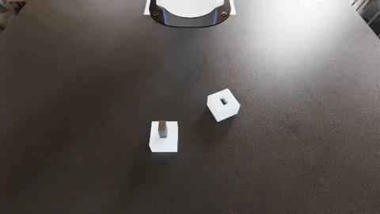
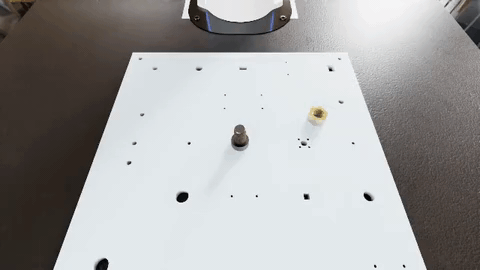

# Assembly Bench

**Contact-rich robot assembly tasks for evaluating and training VLAs.**
Tested headless on L40S, RTX 6000 Ada, and RTX PRO 6000 Blackwell GPUs.

14 tabletop assembly tasks – insert pegs, mesh gears, thread nuts – modelled on the
[NIST ATB-1 assembly taskboard](https://www.nist.gov/el/intelligent-systems-division-73500/robotic-grasping-and-manipulation-assembly/assembly).
The robot is the [DROID](https://arxiv.org/abs/2403.12945) platform (Franka Panda 7-DoF +
Robotiq 2F-85), so any DROID checkpoint plugs in without retargeting. Every task is scored
on real assembly geometry rather than a proximity heuristic: the part has to actually seat,
and a gear that clashes teeth or a nut that cross-threads cannot descend.

- Blog post: [Benchmarking Robot Models on Contact-Rich Assembly](https://www.hud.ai/blog/assembly-benchmark)
- Demonstration dataset (1355 episodes): [`hud-evals/AssemblyBench`](https://huggingface.co/datasets/hud-evals/AssemblyBench)
- Reference checkpoints: [`pi05-AssemblyBench-12k`](https://huggingface.co/hud-evals/pi05-AssemblyBench-12k) (BC) · [`pi05-AssemblyBench-cgdagger-r3`](https://huggingface.co/hud-evals/pi05-AssemblyBench-cgdagger-r3) (final)

## Tasks

| | Family | Tasks | Skills |
|---|---|---|---|
| 🟦 | Round peg insertion | `peg_round_4mm` `peg_round_8mm` `peg_round_12mm` `peg_round_16mm` | insertion |
| 🟪 | Square peg insertion | `peg_square_4mm` `peg_square_8mm` `peg_square_12mm` `peg_square_16mm` | alignment, insertion |
| 🟧 | Gear meshing | `gear_small` `gear_medium` `gear_large` | alignment, insertion, fitting |
| 🟩 | Nut threading | `nut_M8` `nut_M12` `nut_M16` | alignment, threading |

Peg names are stem diameters in mm. Pegs start upright in a presentation bore beside their
hole; gears and nuts start flat on the table. Square pegs are rectangular, so they are not
yaw-symmetric – the hole is re-clocked every episode and the policy has to match it. Part
poses are jittered every episode.

A 15th task, `debug`, puts an apple in a bowl. It is a hello-world check that the
plumbing works, not part of the benchmark.

### pi0.5 successes (one per suite)

Front-camera rollouts from the full-suite eval of
[`pi05-AssemblyBench-12k`](https://huggingface.co/hud-evals/pi05-AssemblyBench-12k),
sped up 5×:

<p align="center">
  
  
</p>
<p align="center">
  
  
</p>

<p align="center">
  <sub>
    🟦 <code>peg_round_4mm</code> ·
    🟪 <code>peg_square_16mm</code> ·
    🟧 <code>gear_large</code> ·
    🟩 <code>nut_M16</code>
  </sub>
</p>

## Requirements

- NVIDIA GPU with RT cores – 16 GB+ for the simulator, 24 GB+ if a VLA shares the same GPU
  (datacenter cards without RT cores, such as A100 and H100, cannot render)
- Ubuntu 22.04+ (Isaac Sim 6 needs GLIBC >= 2.35)

Then, per install option below:

- **Docker (recommended):** Docker with the NVIDIA container toolkit, and an
  [NGC](https://ngc.nvidia.com) account to pull the Isaac Sim base image
  (`docker login nvcr.io`). No Isaac Sim on the host.
- **Host Isaac Sim:** [Isaac Sim 6.x](https://docs.isaacsim.omniverse.nvidia.com/current/installation/download.html)
  installed, and `export OMNI_KIT_ACCEPT_EULA=YES` in every shell that launches Isaac.

Path B's agent side also needs a normal **Python 3.12+** env (separate from Isaac;
`lerobot==0.6.0` will not install on 3.10) and a Hugging Face login that has accepted
[`google/paligemma-3b-pt-224`](https://huggingface.co/google/paligemma-3b-pt-224)
(the pi0.5 tokenizer is gated; the checkpoints themselves are public). On Ubuntu,
install `python3.12-venv` (e.g. via [deadsnakes](https://launchpad.net/~deadsnakes/+archive/ubuntu/ppa)
on 22.04) before creating the agent venv.

### Tested versions

| Component | Pinned at | Where the pin lives |
|---|---|---|
| Isaac Sim (Docker base) | `nvcr.io/nvidia/isaac-sim:6.0.0-dev2` | [`docker/Dockerfile`](docker/Dockerfile) |
| Isaac Sim (host install) | pip `isaacsim[all,extscache]==6.0.0.1` | – |
| Isaac Lab + Isaac Lab Arena | exact commits | git submodules (`git submodule status --recursive`) |
| `hud` (the HUD SDK; renamed on PyPI from `hud-python`) | git `a08d8d83` ([#481](https://github.com/hud-evals/hud-python/pull/481) — `GymBridge` / `Shared`) | setup scripts + Dockerfile + [`requirements-agent.txt`](requirements-agent.txt) |
| Agent env – torch `2.11.0`, lerobot `0.6.0`, … | full freeze (Python 3.12) | [`requirements-agent.lock`](requirements-agent.lock) |

## Install

Clone, then fetch the pinned Arena/IsaacLab submodules. Use the script rather than
`git clone --recursive`: Arena pins nested `git@github.com:` remotes (the script rewrites
them to HTTPS, so no SSH keys needed) and skips Arena's docs-only LFS media:

```bash
git clone https://github.com/hud-evals/assemble-bench.git
cd assemble-bench
./scripts/setup_sim.sh --submodules-only
```

### Option 1 – Docker (recommended)

Self-contained and fully pinned: Isaac Sim base + Isaac Lab (Arena's pin) + Arena +
hud + this bench, with nothing installed on the host.

```bash
docker build -f docker/Dockerfile -t hud-assembly-env .
```

[`docker/docker.md`](docker/docker.md) covers running it: serving Path B (the image's
default command), running Path A commands inside the container, and the cache mounts
that cut boots from ~15 min to ~2 min.

### Option 2 – Host Isaac Sim

For hacking on the environment itself, or Path A without a container. Inside your Isaac
Sim environment (conda env, or an NGC container shell – there, replace `pip` with
`/isaac-sim/python.sh -m pip`):

```bash
export OMNI_KIT_ACCEPT_EULA=YES

# Isaac Lab at Arena's pinned commit (its deps ship with Isaac Sim):
for d in submodules/IsaacLab-Arena/submodules/IsaacLab/source/isaaclab*/; do
  pip install --no-deps -e "$d"
done

# Arena, plus two runtime deps its registries import but don't declare:
pip install -e submodules/IsaacLab-Arena "pin-pink==3.1.0" "rsl-rl-lib==5.0.1"

# This bench, and the HUD serving stack for Path B:
pip install -e assembly_bench
# Path B needs GymBridge/Shared from hud-python#481 (not on PyPI 0.6.x yet):
pip install "hud @ git+https://github.com/hud-evals/hud-python.git@a08d8d83fe56c9427bcba53536c548410dedd330" msgpack
pip install --no-deps "av>=12" "openpi-client==0.1.2"
```

`./scripts/setup_sim.sh` runs exactly these steps (plus the submodule fetch above).
Arena stays unmodified; this repo plugs in through its registration API.

## Running the benchmark

Two paths. **Path A** drives Isaac Sim directly – the usual route if you already have
Isaac Sim on the machine. **Path B (HUD)** serves the sim over the network for evaluating
VLAs, parallel envs, and optional per-episode traces.

### Path A – Isaac Sim directly

Smoke-test that the scene builds (zero actions, no model weights). From the repo root,
with the Isaac env active:

```bash
cd submodules/IsaacLab-Arena
OMNI_KIT_ACCEPT_EULA=YES python isaaclab_arena/evaluation/policy_runner.py \
    --policy_type zero_action --num_episodes 1 --headless \
    --external_environment_class_path \
    assembly_bench.environments.assembly.assembly:AssemblyBenchEnvironment \
    assembly_bench --task peg_round_8mm
```

| Flag | Default | Notes |
|---|---|---|
| `--task` | `peg_round_8mm` | any task id from the table above, or `debug` |
| `--embodiment` | `droid_abs_joint_pos_softmimic` | DROID with this benchmark's contact tuning; `droid_abs_joint_pos` is stock, any `franka_*` also works |
| `--reward` | `none` | `staged` / `potential` add dense reward for RL |
| `--hdr` | `asm_machine_shop` | any Arena HDR registry name, or `none` |
| `--num_envs` | `1` | parallel envs on one GPU |

Or render stills of both policy cameras:

```bash
OMNI_KIT_ACCEPT_EULA=YES python scripts/preview_assembly.py --task peg_round_8mm --out /tmp/peg
# → /tmp/peg_front.png, /tmp/peg_wrist.png  (log should say COLOR OK)
```

Both commands also run inside the Docker image (Install Option 1) – see
[`docker/docker.md`](docker/docker.md).

### Path B – HUD

Serve the environment once, then attach a policy over TCP. The simulator and the policy
can live in different environments (or on different machines).

**1. Serve the env** (pick one)

Docker (Install Option 1; cache mounts and details in [`docker/docker.md`](docker/docker.md)):

```bash
docker run -d --name assembly-env --gpus all \
  -e NVIDIA_DRIVER_CAPABILITIES=all -e OMNI_KIT_ACCEPT_EULA=YES \
  -p 127.0.0.1:8765:8765 hud-assembly-env
```

Or host Isaac (Install Option 2):

```bash
OMNI_KIT_ACCEPT_EULA=YES python -m hud.environment.server env.py --port 8765
```

Wait for `HUD_SERVE_PORT=8765` in the logs (first boot can take 5–15 minutes).

**2. Run a VLA**

The wire is DROID: front + wrist RGB at 640×360, joint positions, 8-D action (7 joint
targets + binary gripper) at 15 Hz. [`examples/`](examples/) loads our final pi0.5
checkpoint from Hugging Face:

```bash
python examples/run_eval.py --task peg_round_16mm --num-envs 4
```

First run downloads ~9 GB of weights.

| Flag | Default | Notes |
|---|---|---|
| `--task` | `peg_round_16mm` | any task id from the table above, or `debug` |
| `--num-envs` | `4` | parallel episodes in one sim process |
| `--waves` | `1` | sequential batches (`15 × 2` = the writeup's 30-ep protocol) |
| `--checkpoint` | `hud-evals/pi05-AssemblyBench-cgdagger-r3` | HF repo id or local dir |
| `--runtime` | `tcp://127.0.0.1:8765` | where the env is serving |

**3. Stream traces (optional)**

Everything grades locally with no account. Set `HUD_API_KEY` to also upload each episode's
video, actions, and reward to [hud.ai](https://hud.ai):

```bash
export HUD_API_KEY=sk-hud-...
python examples/run_eval.py --task peg_round_16mm --num-envs 4
```

Without the key, nothing is sent anywhere.

> An LLM tool-use path (`agents/`, `tasks/agent/`) is **in development** and not ready
> for use yet.

## Test your install

| Check | Command | Expect |
|---|---|---|
| Quick (Path A, no weights) | `python scripts/preview_assembly.py --task peg_round_8mm --out /tmp/peg` | two PNGs, `COLOR OK` |
| Full (Path B + pi0.5) | serve env, then `python examples/run_eval.py --task peg_round_16mm --num-envs 2` | episodes grade; optional job URL if `HUD_API_KEY` is set |

## Additional information

### Layout

```
assembly_bench/
├── scripts/setup_sim.sh     the Install "Host Isaac Sim" steps as one script
├── scripts/setup_agent.sh   the Install "Agent environment" steps as one script
├── requirements-agent.txt   agent-side pins (Path B); the .lock is the full tested freeze
├── assembly_bench/          the pip-installable Arena environment package
│   ├── environments/assembly/   variants.py (the task catalog), scene, tasks, rewards
│   └── assets/parts/            pegs, gears, nuts, NIST board
├── examples/                pi0.5 VLA + eval runner
├── tasks/                   HUD run lists
├── docker/                  self-contained Isaac + HUD image (build from this repo)
├── docs/media/              README collage GIFs (pi0.5 successes, one per suite)
├── env.py, contract.json    HUD entry point and its observation/action wire
└── submodules/IsaacLab-Arena    unmodified Arena (git submodule)
```

### Adding your own task

Tasks are pure Python data, not USD scenes. Add an entry to `VARIANTS` in
[`variants.py`](assembly_bench/environments/assembly/variants.py) – which parts to spawn,
where, and the seat geometry that defines success – then run `python scripts/taskset.py`
to refresh the HUD run lists. See [`tasks/README.md`](tasks/README.md).

### Dense rewards for RL

Evaluation uses sparse success (`--reward none`). For training, `--reward staged` gives
milestone rewards (lift, engage, thread start, success) plus best-so-far progress, and
`--reward potential` uses signed potential differences so backsliding is penalised. Both
are also available as `make_assembly_env(..., reward=...)`.

### Scripted experts

The demonstration dataset was generated without teleoperation, by scripted experts that
read privileged simulator state:

```bash
python scripts/experts/run_expert.py --headless --task peg_round_8mm --num_envs 4
```

See the docstring in [`run_expert.py`](scripts/experts/run_expert.py) for recording
recipes. `scripts/experts/rl/` holds the code-gated DAgger loop from the writeup, enabled
on the HUD path with `ASSEMBLY_EXPERT_TAKEOVER=1`.

### Credits

Built on [Isaac Lab Arena](https://github.com/isaac-sim/IsaacLab-Arena) and Isaac Sim 6
(NVIDIA). Task design follows NIST's
[ATB-1 assembly benchmarking procedure](https://www.nist.gov/el/intelligent-systems-division-73500/robotic-grasping-and-manipulation-assembly/assembly),
and the contact-rich assembly setup builds on
[Factory](https://arxiv.org/abs/2205.03532) and [FORGE](https://arxiv.org/abs/2408.04587).
The robot platform and reference checkpoints come from
[DROID](https://arxiv.org/abs/2403.12945).
